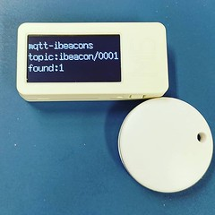
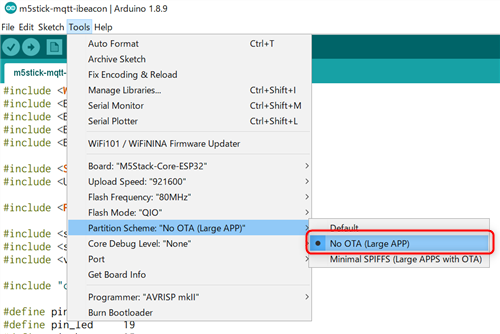

# m5stick-mqtt-ibeacon

## Settings
You should make the following settings before uploading this sketch.

 

## See also...
  - [M5Stick Quick Start - Arduino Win](https://docs.m5stack.com/#/en/quick_start/m5stick/m5stick_quick_start_with_arduino_Windows)
  - [olikraus/u8g2 Wiki · GitHub](https://github.com/olikraus/u8g2/wiki)
  - [knolleary/pubsubclient: A client library for the Arduino Ethernet Shield that provides support for MQTT.](https://github.com/knolleary/pubsubclient)

## Copyright and license
Copyright (c) 2019 yoggy

Released under the [MIT license](LICENSE.txt)